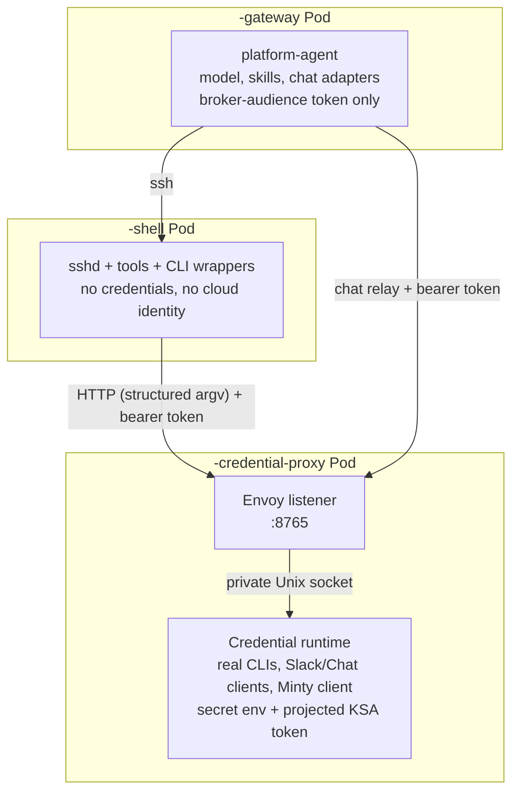

The PlatformAgent shell sandbox receives no API keys, access tokens, refresh tokens, or Kubernetes ServiceAccount tokens through its environment or filesystem, and its ServiceAccount is bound to no Google service account, so the metadata server has nothing to give it either. Credentials live in a trusted **credential broker** that runs as a Pod of its own, and the sandbox reaches credentialed capabilities only through a policy-enforced proxy across the network.

This is the only layout. There is no configuration that puts the broker back in the agent Pod and none that turns the shell sandbox off — `spec.harness.experimental.shellSandbox.enabled: false` is refused with `Degraded`/`ShellSandboxCannotBeDisabled`. The gateway's `platform-agent` container does hold one credential, the audience-bound token it presents to the broker — two under the unsupported `mode: next` toggle, which adds the A2A bus's `worker` password by SecretKeyRef; [the agent now holds a credential](#the-agent-now-holds-a-credential-and-that-was-a-choice) has the trade.

This page summarizes the architecture. The canonical design — including scope, deny-policy details, migration steps, and CI verification assertions — is [`docs/credential-isolation-design.md`](https://github.com/gke-labs/kube-agents/blob/main/docs/credential-isolation-design.md).

## Pod anatomy

Each PlatformAgent runs as three Pods.

| Pod / container                        | Trust level | Role                                                                                                                    |
| -------------------------------------- | ----------- | ----------------------------------------------------------------------------------------------------------------------- |
| **`<name>-gateway`**                   |             |                                                                                                                         |
| &nbsp;&nbsp;`platform-agent`           | Untrusted   | The model, the skills and the chat adapters. No CLI, and one credential: the broker-audience token.                     |
| &nbsp;&nbsp;`agent-api-auth`           | Trusted     | The PlatformAgent API front door, and the event watcher, which forwards cluster events on its own Kubernetes-API token. |
| &nbsp;&nbsp;`fluent-bit`               | Trusted     | Log forwarding.                                                                                                         |
| &nbsp;&nbsp;`platform-agent-dashboard` | Untrusted   | Optional local dashboard (also credential-free).                                                                        |
| **`<name>-shell`**                     | Untrusted   | `sshd`, `/opt/data`, the agent's tools and the CLI wrappers. Everything the model executes runs here.                   |
| **`<name>-credential-proxy`**          | Trusted     | Envoy, the credentialed command and chat runtime, the Minty client. Runs nothing the model wrote.                       |

`agent-api-auth` is a **native sidecar** — an `initContainers` entry with `restartPolicy: Always`, needing Kubernetes 1.29+ — so it starts before the others and does not appear in `spec.containers`.



The sandbox image contains only **wrapper binaries** for `gcloud`, `kubectl`, `gh`, and `git`. A wrapper sends the executable name and argument array to Envoy at the broker Service; the credential runtime executes the corresponding real CLI and returns output and exit status. It never evaluates an agent-supplied shell command, and the runtime's Unix socket is mounted only in the broker Pod, so the sandbox cannot bypass Envoy. The real credential-aware CLIs ship in a separate `credential-proxy` image that neither the gateway nor the sandbox runs.

**The broker authenticates every caller.** A projected ServiceAccount token, one hour long, with an audience chosen per pod (`kubeagents-credential-proxy` for the sandbox, `kubeagents-credential-proxy-chat` for the gateway), presented as a bearer header and verified with a Kubernetes `TokenReview`; the audience is what tells the broker which caller it is serving. Every path except `/healthz` requires it, and an unidentified caller gets an undifferentiated `401`. `CREDENTIAL_PROXY_ALLOWED_CALLERS` names the two ServiceAccounts served: the sandbox's, where credentialed commands originate, and the gateway's, because the chat relays use the same listener.

**Nothing crosses as a path.** No filesystem is common to the sandbox and the broker, so a directory name sent from one means nothing in the other — or, worse, names a same-named directory of the broker's. The working directory is therefore not sent at all, and every proxied command runs at the broker's own workspace root. Three things cross instead: a document on stdin, a kubeconfig as a **context name**, and a commit as file content plus a message.

The environment does not cross either. The command runs with an environment the broker builds itself, so exporting a variable in the agent shell has no effect on the proxied process.

**A kubeconfig names a cluster; it never supplies content.** A kubeconfig is executable configuration, not passive data. Fields such as `users[].user.exec.command`, `clusters[].cluster.server`, and `users[].user.tokenFile` would respectively run a program next to the credentials, redirect the minted access token, and disclose a broker file as a bearer token. None of it is visible to the [command policy](#request-paths), whose rules match on the argument array: the argv is only ever `kubectl get pods`. The design doc has the [full enumeration and the reasoning](https://github.com/gke-labs/kube-agents/blob/main/docs/credential-isolation-design.md#agent-supplied-kubeconfigs).

So the caller sends one string, a context name, the broker accepts it only if it is a well-formed `gke_<project>_<location>_<cluster>`, and it regenerates the kubeconfig itself with `gcloud container clusters get-credentials` into a directory mounted only in the broker Pod. That regenerated file is what every proxied command runs against (on an install that has armed the [scoped service account pool](/kube-agents/reference/security-and-iam/#the-scoped-service-account-pool), `kubectl` runs against a further derivation of it carrying the pool member's token). `get-credentials` is the one command allowed to author a kubeconfig, and it writes only into the broker's own directory.

Naming a cluster is not extra authority — `get-credentials` is bound by the same IAM the proxy already runs under, so it can only reach clusters this identity could reach anyway. A context name the proxy cannot regenerate from is rejected with `400` rather than honored.

**The broker owns the only checkout.** The agent no longer creates a directory the broker then runs `git` in, because there is no volume both can see. A skill that wants to change a repository sends file content and a commit message, and the broker writes, commits and pushes in a working tree on its own volume that the agent has no path to. That closes the `.git/config` class outright: `core.fsmonitor` and every other setting that names a program to run is read by `git` on every invocation, including read-only ones, and no argument-level policy could enumerate it — but the agent cannot write into the tree it is read from.

Leases still order concurrent writers inside the broker, since a Pod runs six audit crons alongside every kanban worker. The proxy refuses `git add`, `commit`, `checkout`, `push`, `reset` and the other verbs that write a working tree or a remote ref unless the resolved directory sits under one holding a `.lease` marker; the refusal is `SECURITY_POLICY_BLOCKED` with rule `git.workspace.lease`. It is a floor rather than an ownership check — the broker can tell that a push is happening inside _some_ lease, not whose. [`docs/designs/gitops-workspace-leases.md`](https://github.com/gke-labs/kube-agents/blob/main/docs/designs/gitops-workspace-leases.md) is canonical for the layout and the reaper.

**`git` runs with its configuration pinned by the proxy.** `git` is the one permitted executable that takes both its transport and its helper programs from configuration files, and several of those it reads from paths a caller could once influence — so its defaults are overridden rather than trusted. Every proxied `git` runs with the transport allowlist restricted to `https`, the system configuration file suppressed, the global configuration file pinned to a path mounted only in the broker Pod, the hooks directory pinned to an empty directory the agent cannot write to, the file-system monitor disabled, commit signing disabled along with the signing program of every signature format git supports rather than just the default one, subcommand autocorrection off, and both of the editors `git` launches set to a command that does nothing — the broker has no terminal, so nothing that needed one could have worked anyway.

The proxy also refuses, in the argument array, the global options that would undo any of that — `-c` and `--config-env`, which set configuration outranking the pins; `--exec-path`, which chooses where git looks for the program to run; `--git-dir` and `--work-tree`, which name a repository directly and so sidestep the workspace containment applied to the working directory; and `--global`, `--system` and `--file`, which write the configuration files the proxy pins. `-C` remains available for choosing a directory inside a leased workspace, since the containment check follows it, and repository-local `git config` remains available because that is how a clone's commit identity is set. Refused alongside them are the subcommands whose purpose is to run a caller-named command, among them `bisect`, `difftool`, `mergetool`, `filter-branch`, `send-email` and `help`. Refused too are the options that do the same job on an ordinary subcommand: running a command once per commit during a rebase, over the matches of a search, to compute a commit trailer's value, or — for `--help` — through the documentation viewer. The viewer needs both entries: `git help -m` and `git help -w` run the program named in `man.<tool>.cmd` or `browser.<tool>.cmd`, and `git status --help` reaches the same viewer with `status` in the subcommand slot, so neither refusal closes it alone. No pin can reach those keys, because the name inside the key is arbitrary. `-h` stays available; git answers it from the subcommand's own option table without starting a viewer. The design doc has the [full list and the reason it is a denylist rather than an allowlist](https://github.com/gke-labs/kube-agents/blob/main/docs/credential-isolation-design.md#git-configuration). Every refusal comes back as `SECURITY_POLICY_BLOCKED` with rule `git.argument.refused`, and no shipped skill uses any of them.

These pins were never what handled configuration stored inside a repository's own `.git/config`, which no pin can reach. That is closed by the broker owning the tree instead — `CREDENTIAL_PROXY_CONTENT_WORKSPACE` is set unconditionally and the proxy serves `/v1/workspace/*`, where the caller sends file content and a commit message. There is no field to turn it off: an install that could would be choosing to keep the class open. The design doc has [the mechanism and what it is and is not worth](https://github.com/gke-labs/kube-agents/blob/main/docs/credential-isolation-design.md#broker-owned-working-trees).

**`kubectl` and `gcloud` are read-only by default.** The proxy enforces that `kubectl` may not run mutating verbs like `delete`, `create`, `patch`, or `rollout restart`, and that `gcloud` may not run commands that change cloud resources. It refuses the flags that would change which identity a command authenticates as or which server receives the credential — `--as`, `--server`, `--token`, `--kuberc`, `--insecure-skip-tls-verify` and their `gcloud` equivalents — and the refusal comes back as `SECURITY_POLICY_BLOCKED` with a rule such as `kubernetes.read-only` or `kubernetes.identity-change-forbidden`.

**`gh` may not complete a change on GitHub.** The agent's job is to propose, so the proxy refuses the verbs that would let it also dispose: merging a pull request (`github.merge`), approving a review (`github.assent`), mutating through the REST API — `gh api` with `-X POST|PUT|PATCH|DELETE` or a field flag (`github.api-mutation`), triggering a workflow run or cutting a release (`github.pipeline-trigger`), and repository administration — secrets, variables, and repository delete, archive or edit (`github.repo-administration`). Rulesets are not on that list because `gh ruleset` cannot change one: it has only `check`, `list` and `view`, and reshaping a ruleset goes through `gh api`, where `github.api-mutation` refuses it. Opening pull requests, issues and comments is untouched, which is the path the product runs on. The refusal is `SECURITY_POLICY_BLOCKED` with the rule id.

These are **deny** rules shipped in the operator's policy ConfigMap, not entries in the `command_policy.py` allowlist the paragraph below is about, so a false refusal here is fixed in a different place — see the appeal note at the end of this section.

**How much this allowlist is carrying depends on the permission set.** On a default `read-only` install it is the outermost of three layers, not the whole control: the agent's KSA holds no write verb on workloads or cluster state, so the API server refuses a mutation the allowlist missed, and the GSA holds `container.viewer`/`container.clusterViewer` only, so a `gcloud` mutation is refused at GCP. [Security and IAM](/kube-agents/reference/security-and-iam/) is canonical for what the agent may and may not do; this page describes only the proxy's own layer.

Under a `custom` permission set that names an admin role, that stops being true. `roles/container.admin` authorizes the agent through IAM regardless of its Kubernetes RBAC, so both layers beneath the allowlist fall away and a command it fails to refuse runs with the broker's full credential. Treat the allowlist as the only control in that configuration — which is one reason the built-in bundle that granted that role was removed.

Kubernetes impersonation is planned and not yet deployed; once it ships, the API server will authorize each request as the requesting human user rather than as the agent. Note also that the current deployment shares one Google service account across every agent — that is the gap impersonation closes, not a mitigation.

A first deployment in a live environment will find read-only commands nobody anticipated. For a `kubernetes.*` or `gcp.*` refusal the fix is to add the verb to the allowlist in `command_policy.py` and ship it — except `gcp.scoped-sa.unmapped-scope`, which is not a verb problem at all: it means the request named a cluster the [scoped service account pool](/kube-agents/reference/security-and-iam/#the-scoped-service-account-pool) has no entry for, and the fix is adding the cluster to the pool's mapping (or leaving the pool disarmed). For a `github.*` or `git.*` one it is the deny policy the operator renders, which is a different file and a different review. Either way, that keeps the change reviewable and scoped to the one command that was missing. Report the blocked command to your infrastructure team with the rule id from the refusal.

## Credential placement

| Data                             | `<name>-shell`                | `platform-agent`       | Credential broker         |
| -------------------------------- | ----------------------------- | ---------------------- | ------------------------- |
| `spec.deployment.env`            | No                            | No                     | Yes                       |
| Slack tokens                     | No                            | No                     | Yes, Secret-backed env    |
| PlatformAgent external API key   | No                            | No                     | Yes, Secret-backed env    |
| Session KV API key and HMAC salt | No                            | Yes, Secret-backed env | Yes, API key only         |
| Automatic KSA token mount        | Disabled                      | Disabled               | Disabled                  |
| Explicit projected KSA token     | Broker audience               | Broker audience        | Read-only, one-hour token |
| Cloud identity via metadata      | None — unbound ServiceAccount | Yes                    | Yes                       |
| gcloud/kubectl configuration     | No                            | No                     | Private `emptyDir`        |
| GitHub installation token/cache  | No                            | No                     | Private `emptyDir`        |
| Working tree for proxied `git`   | No                            | No                     | Broker's own volume       |

`SESSION_KV_API_KEY` and `SESSION_KV_SALT` are `platform-agent`'s only Secret-backed environment variables, and both are pod-scoped: neither opens anything outside the gateway Pod. They cannot sit behind the proxy because that container is the _server_ here — `session_kv_server.py` binds `127.0.0.1:8699` and needs the key in order to reject callers that are not the event watcher, the Platform MCP server, the `incident_context` plugin, or the kanban notifier — and because the salt hashes chat identities before they are written, which has to happen where the identity already is. The design doc has the [full reasoning](https://github.com/gke-labs/kube-agents/blob/main/docs/credential-isolation-design.md#the-loopback-only-exception). Both are optional in the sense that the pod starts without them, and one of them is not optional in practice: the `k8s-event-watcher` in `agent-api-auth` authenticates with `SESSION_KV_API_KEY` and treats an empty value as fatal, so it exits on every start and no cluster events are watched at all — the container stays Ready, so its log is the only place that says so. The Session KV server also answers `503`, and identity hashing falls back to a per-process salt with a warning.

Pod-wide `automountServiceAccountToken` is `false` everywhere. The broker's own projected token uses the audience `kubeagents-credential-proxy` and expires after one hour, and the gateway's is minted for `kubeagents-credential-proxy-chat`; the event watcher gets a separate one-hour Kubernetes-API token projection in `agent-api-auth` at the conventional in-cluster path. Neither is mounted in the sandbox or the dashboard.

## Request paths

- **CLI commands** — only `gcloud`, `kubectl`, `gh`, and `git` are accepted. The proxy rejects known credential-disclosure, credential-replacement, and self-modification operations, and the GitHub write path (see below); interactive TTY programs, unbounded streaming, sandbox-only file paths, and background processes fail closed.
- **Chat** — Slack and Google Chat adapters send credential-free payloads to Envoy; the credential runtime owns the platform tokens and performs the external API calls, enforcing user allowlists and payload limits.
- **PlatformAgent API** — the Service targets port 8643 on `agent-api-auth` in the gateway Pod, which validates the external bearer key and forwards to the agent API on loopback (port 8642) with a non-secret sentinel. The real key never reaches `platform-agent`.
- **GitHub** — the broker obtains a Google OIDC identity token and calls [Minty](/kube-agents/deploy/token-minter/), which brokers a repository-scoped GitHub App installation token with a maximum one-hour lifetime. The App's private key stays in Cloud KMS.

## Guarantee and limitation

**Guarantee:** the operator places no managed credential in the `<name>-shell` Pod's environment, root filesystem, persistent data volume, or ServiceAccount token path — and its ServiceAccount carries no `iam.gke.io/gcp-service-account` annotation, so the metadata server answers it with a principal IAM grants nothing. That is the Pod that runs everything the model wrote. `spec.deployment.env` goes to the credential broker because it may contain credentials; only a short allowlist reaches the agent — the OpenTelemetry settings, `EOD_EXCLUDE_NAMESPACES`, and the `ALERT_DAILY_LIMIT_*` alert ceilings — as literal values only.

**Limitation:** the gateway Pod keeps a cloud identity. It and the broker Pod share the `kubeagents-platform-agent` ServiceAccount, whose Workload Identity annotation lets anything with execution in either mint the Google service account's token from `169.254.169.254`. The sandbox cannot, which is the property this page is about; what is left is trusted code holding more than it needs. Two ways to close it — configure [`spec.security.workloadIdentityFederation`](#running-the-shell-in-its-own-pod), which gives the broker a credential source that is a file in its own Pod, or give the broker a ServiceAccount of its own and take the annotation off the gateway's. Neither ships today, and [Denying the sandbox the metadata server](#denying-the-sandbox-the-metadata-server) does not close it either.

**The sharing that made this a container-boundary problem is gone.** The broker is not in a Pod with anything that runs model-authored code, so there is no shared network namespace, no shared process namespace, and no shared writable volume. [`docs/security-requirements.md`](https://github.com/gke-labs/kube-agents/blob/main/docs/security-requirements.md) tracks the requirement and the remaining gap formally.

### The agent now holds a credential, and that was a choice

The `platform-agent` container mounts the broker-audience projected token, so the model can read it. A prompt-injected agent gains no new authority _inside_ the Pod, because it could already reach the broker. What it gains is **exportability**: the token is a file, and a file can be exfiltrated, after which an outside party has broker access — bounded by the command policy — until the token expires.

Against the credential requirements this token is short-lived, audience-bound and independently revocable, but **not non-exportable**, and that last clause is the one it misses.

**An alternative was considered and deferred.** `agent-api-auth` is already a credential-holding container in the agent Pod, on loopback, at a different UID, with no volumes the agent can read. A mirror image of it — an egress forwarder that holds the token, listens on `127.0.0.1:8765`, and attaches the credential on its way out to the broker Service — would preserve "the agent holds no credential at all". It is not built because it is a new component with its own failure modes and lifecycle, and nothing forecloses it: the client's `authorization_headers()` would return nothing and the forwarder would supply the header instead.

## Running the shell in its own Pod

Everything the agent executes — the wrappers, `execute_code`, and the file tools — runs in a `<name>-shell` StatefulSet reached over SSH. This is not optional: `spec.harness.experimental.shellSandbox.enabled: false` is refused with `Degraded`/`ShellSandboxCannotBeDisabled` and changes nothing about the running workload. [`docs/designs/agent-shell-sandboxing.md`](https://github.com/gke-labs/kube-agents/blob/main/docs/designs/agent-shell-sandboxing.md) is canonical.

`spec.security.workloadIdentityFederation` is the optional hardening on top. With it, the broker takes its cloud identity from an audience-scoped projected token mounted in its Pod alone and exchanged through Workload Identity Federation — whose credential source is a **file path** rather than the metadata server — for an impersonation of the existing Google service account. Without it the broker uses the metadata server and the ServiceAccount the gateway also runs as, which is the limitation above. The design doc has the one-time pool setup, which no install surface performs.

## Denying the sandbox the metadata server

`spec.security.egressPolicy: Allowlist` renders one NetworkPolicy on the agent Pod: default-deny egress, with rules for DNS, the credential broker, LiteLLM, the namespace of the OpenTelemetry collector the agent resolved (the managed one by default; no rule when the endpoint names nothing in-cluster), the Hindsight memory API, the A2A NATS pods on TCP `4222` (only under the unsupported `mode: next` toggle — the rule appears and disappears with the A2A stack), and whatever `spec.security.egressAllowlist` adds. The metadata server's credential API is denied by not appearing on that list.

The DNS rule is the one place a metadata address does appear, on port 53 alone. On a cluster using [Cloud DNS for GKE](https://cloud.google.com/kubernetes-engine/docs/how-to/cloud-dns) the node answers DNS at `169.254.169.254:53` and every Pod's `resolv.conf` names it, so withholding it is not a narrower credential path — it is no name resolution, and every destination in this allowlist is reached by name. The token is minted over TCP 80 pre-NAT and 988 post-NAT, and no rule permits _this address_ on either. (TCP 80 is permitted to the LiteLLM Pod selector, which no link-local address matches.)

The peer does widen one thing, on one kind of cluster. Where CoreDNS forwards externally — the stock configuration — it grants nothing the `k8s-app: kube-dns` peers above do not already grant, since those resolve arbitrary external names. Where an administrator has removed that forwarding to close DNS as an exfiltration path, this peer hands the Pod the node's GCE recursive resolver and reopens it. GKE's metadata interception rewrites TCP 80 and 8080, not 53, so the address answers DNS there on any GCE node not running `gke-metadata-server` or metadata concealment. If that describes your cluster, the peer is the one part of this policy to weigh rather than accept.

### This blocks nothing today

**Turning this on does not take any egress away from the agent Pod. It cannot.** Adding a NetworkPolicy is a monotone operation: policies selecting one Pod are unioned, the Pod may send whatever any of them permits, and the API has no deny rule at all. The agent Pod is already selected for egress by `<name>-gateway-netpol`, which the operator renders on every reconcile whether or not you set this field, so with the flag on the Pod's permitted egress is a strict _superset_ of what it was with the flag off. In the default shape it adds the credential broker on TCP 8765, and — when the agent is not exporting telemetry — the managed collector namespace on 4317/4318, because the gateway policy renders its own OTel rule only while there is an endpoint to export to and this one keeps `gke-managed-otel` on a cluster that resolved to no collector, so that exports are not blocked the moment a collector appears there. With an endpoint, both policies read the namespace off it and name the same one. The `platformagent-egress-allowlist` golden fixture is the no-collector case: `gke-managed-otel` appears in the new policy and not in the gateway one.

That holds wherever another policy still permits the wider egress, which is every install shape but one. `spec.networkPolicy.enabled: false` stops the operator rendering `<name>-gateway-netpol` at all and deletes one it owns — but it withholds only the operator's own policies. A Kustomize install still carries the statically applied `platform-agent-core-egress` set, which selects the same Pod and permits the metadata path and external 443, so the union argument resumes there. On a **Helm** install with the field false, this policy really is the only one selecting the agent Pod, and on an enforcing CNI it then default-denies for real — the metadata server, but also GitHub, web search, external 443 and everything else not on the allowlist. Everywhere else it is a property of the API, not of a particular cluster.

What `<name>-gateway-netpol` already permits, and this therefore cannot remove:

- `169.254.169.254/32` on TCP 80, plus the discovered metadata-daemon port (`988` by default) to both link-local metadata addresses — the pre- and post-DNAT forms of a metadata request. The metadata path stays open. (It also permits the same address on port 53, as this policy does, for the Cloud DNS reason above; that one is not part of the metadata path.)
- TCP 443 to `0.0.0.0/0` minus the private ranges, unless FQDNNetworkPolicy is enabled. Every HTTPS destination on the public internet stays open, and with it the exfiltration half of what this is meant to be.

`platform-agent-core-egress` from [`deploy/kustomize/platform/`](https://github.com/gke-labs/kube-agents/tree/main/deploy/kustomize/platform) permits the same metadata path and selects the agent Pod by `app.kubernetes.io/name`. Kustomize installs have it; Helm installs do not. It changes nothing either way — the gateway policy alone settles the point.

The overlap is deliberate rather than an accident. Workload Identity needs that path, and the gateway Pod still uses it: it shares the annotated ServiceAccount with the broker, so the gateway policy cannot stop permitting it without breaking every install. Giving the broker a ServiceAccount of its own, or configuring Workload Identity Federation, is what would let the gateway policy drop that rule — and that is the work that turns this field into a control.

**So what is it for today?** Two things, neither of them enforcement. It renders an auditable statement of the destinations the agent is supposed to need, as an object you can diff and a reviewer can read. And it settles the field, the refusal rules and the reconcile behaviour now, so that narrowing the gateway policy later is a one-policy change rather than a new feature. If you were planning a capability-impact review before enabling this, you do not need one yet; [what it will cost](#what-it-will-cost-once-it-does-block-something) says when you will.

The complementary control is removing the `iam.gke.io/gcp-service-account` annotation from the agent Pod's ServiceAccount once the broker has one of its own — deny the route versus remove the identity. That one does not depend on the CNI at all, and unlike this it would take something away immediately. It is separate, planned work. The `<name>-shell` Pod already has it: its ServiceAccount carries no annotation, so there is nothing for it to mint.

### The other conditions, plainly

None of these is enforced by the operator. The one that used to be — the broker having left the agent Pod — is now unconditionally true, so the field no longer has a prerequisite to refuse.

1. **The cluster CNI must enforce NetworkPolicy, and the operator cannot tell whether it does.** An unenforced policy is accepted, stored, and returned by `kubectl get` exactly like an enforced one; there is no field, condition or event to read. GKE Autopilot and GKE Dataplane V2 always enforce. A GKE Standard cluster created without network policy gets a no-op.
2. **No other policy may widen it**, which is the point above and also applies to anything an administrator adds later. Nothing detects that.
3. **The allowlist has to stay complete**, and it deliberately is not — see [what it will cost](#what-it-will-cost-once-it-does-block-something). Every gap is pressure toward a broader rule.

### What a refusal does, and does not do

**Refused means not reconciled, not stopped.** On a new agent those are the same thing — no Deployment is created. On an agent that is already running, the existing Pods keep running exactly as they were, **with metadata access**, and every subsequent change to the resource is ignored while the operator retries every 30 seconds. The refusal protects you from believing you have the control; it does not take the workload down to make the point. `kubectl describe platformagent` is where you find out.

One refusal reason remains. `EgressAllowlistRefused` **still renders the policy**, minus the destinations it refused: the objection is to one value, not to the control, so the guardrail keeps being reconciled — delete it and the next pass puts it back — while the status stays `Degraded` until the spec is fixed.

### Turning it back off, which has an order

**Setting `egressPolicy: None` does not delete the policy.** The operator will not remove a guardrail it may not have created, so `<name>-sandbox-metadata-deny` stays in the namespace after the field goes off. On its own that is fail-closed and fine: the Pod it selects keeps a door shut that nothing is asking to open.

To remove it, two steps in order:

1. Set `egressPolicy: None`.
2. `kubectl -n NAMESPACE delete networkpolicy NAME-sandbox-metadata-deny`. This is safe only after step 1 — delete it while the field still says `Allowlist` and the next reconcile puts it straight back.

The ordering risk that used to attach to reverting the broker split is gone with the flag: the broker cannot come back into the agent Pod.

### Pre-enable checks

Two things to verify on the cluster, neither of which the operator can check for you:

- **Does the CNI enforce NetworkPolicy?** `gcloud container clusters describe CLUSTER --format='value(networkPolicy.enabled,networkConfig.datapathProvider)'`. Autopilot and Dataplane V2 always do. A GKE Standard cluster created without network policy gets a policy object that enforces nothing.
- **Does the cluster run NodeLocal DNSCache, and does DNS still resolve after enabling?** This one can take the agent down. NodeLocal DNSCache runs with `hostNetwork`, so on Cilium and Dataplane V2 its traffic carries a host or remote-node identity — and neither the `k8s-app: node-local-dns` Pod selector nor the `169.254.20.10/32` CIDR peer in the rendered rule is guaranteed to match that (the rule also carries the resolved cluster DNS ClusterIP, for the dataplanes that match the Service VIP instead, and `169.254.169.254/32` for Cloud DNS for GKE), because CIDR peers do not select node identities unless `policy-cidr-match-mode` includes `nodes`, which is off by default. Both peers work on an iptables dataplane, which is why both are rendered. If neither matches, DNS is blocked outright and every destination in the allowlist becomes unreachable, because they are all reached by name. Check with `kubectl -n kube-system get ds node-local-dns` first, and after enabling confirm resolution from the agent container before trusting the policy.

### What it will cost, once it does block something

**None of this happens today** — with the one exception above: a Helm install running `spec.networkPolicy.enabled: false` on an enforcing CNI pays this whole bill the moment the flag goes on. Everywhere else, every destination below is one `<name>-gateway-netpol` still permits to the same Pod, so you can enable the flag and observe no behaviour change in either direction. This is the bill that falls due once the gateway policy is narrowed, and it is here so that the narrowing is not a surprise.

At that point the allowlist covers DNS (selector peers, the resolved cluster DNS ClusterIP, and the Cloud DNS resolver — the same ladder the gateway policy renders), the broker, LiteLLM, the OTel collector, the Hindsight memory API and (under the unsupported `mode: next` toggle) the A2A NATS pods, and everything the agent container reaches on its own would go away:

- DuckDuckGo web search, which `deploy/shared/defaults/config.yaml` turns on for every profile (`web.backend: ddgs`), and the `browser` toolset, which only the Chat Agent disables;
- the `gke` and `developer_knowledge` MCP servers, which proxy `container.googleapis.com` and `developerknowledge.googleapis.com`;
- `github.com` reached directly from the sandbox — not the `gh` and `git` wrappers, which go through the broker;
- the metadata lookup in `cluster_agent_reconcile.py`, which is how that script finds its project id. It fails soft after a five-second timeout and falls back to `gcloud config get-value project`, a broker call that is on the allowlist, so the cost is the timeout on each tick. Setting `RECONCILE_PROJECT` skips it.

Credentialed `gcloud`, `kubectl`, `gh` and `git` would be unaffected either way: they are wrappers that call the broker, and the broker is on the list.

None of that would be accidental. A headless browser with unrestricted egress is the exfiltration path, so the capabilities this would remove are the same ones that make the control worth having. Weigh it as a trade rather than a regression, when it arrives.

### Restoring a destination

`spec.security.egressAllowlist.extraRules` takes NetworkPolicy egress rules verbatim. Two things to know:

- **NetworkPolicy matches addresses, never DNS names.** Restoring a hosted service means naming its published address ranges and keeping them current.
- **A rule whose `ipBlock` contains a metadata address is dropped, not narrowed.** That includes `0.0.0.0/0` with an `except` clause naming the metadata server — see below for why an `except` clause is not a block. To grant broad egress you have to carve the ranges around `169.254.169.252` and `169.254.169.254` yourself, in the spec, where a reviewer can see it.

`spec.security.egressAllowlist.controlPlaneCIDRs` is separate because there is no NetworkPolicy peer for "the Kubernetes API server": on GKE the control plane is not a Pod and not in the cluster, and the in-cluster `kubernetes` Service address is translated to it before policy is evaluated. Left empty the rule is simply absent and nothing in the agent Pod can reach the API, which matters above one replica, where the container runs `leader_elect.py` and holds a Lease. Find the range with `gcloud container clusters describe CLUSTER --format='value(privateClusterConfig.masterIpv4CidrBlock,endpoint)'`.

### Why it is default-deny rather than "allow everything except the metadata server"

The obvious shape — one broad rule with the metadata address in an `except` clause — is what this repository shipped once before, and it is unsound twice over on GKE:

- **On GKE Dataplane V2 it is a near-total outage, not a permissive rule.** Google's documentation states that Pod traffic is never covered by an `ipBlock` rule, so a policy whose only peer is `0.0.0.0/0` permits no Pod-to-Pod traffic at all — not kube-dns, not LiteLLM, not the broker.
- **On an iptables dataplane the `except` clause names an address the policy never sees.** A request to `169.254.169.254:80` is translated to the node-local metadata server at `169.254.169.252:988` in NAT PREROUTING, before the filter rules run. This is [kubernetes/kubernetes#68078](https://github.com/kubernetes/kubernetes/issues/68078), open since 2018 and titled "Network policy not properly blocking GKE metadata IP".

Default-deny sidesteps both: it names Pods with selectors rather than CIDRs, and it does not have to predict which address the request was rewritten to, because no rule permits either address on a port the token can be minted over. For the same reason all three metadata addresses — `169.254.169.254`, `169.254.169.252` and the IPv6 `fd20:ce::254` — are refused in `extraRules`, on every port. The DNS rule's port-53 grant to `169.254.169.254` is the operator's alone; `extraRules` cannot widen it. `spec.networkPolicy.additionalEgress` is a separate matter — it appends to the gateway policy over the same Pod and is bounded by prefix width rather than by destination, so it can reach a metadata address. See [Security and IAM](/kube-agents/reference/security-and-iam/#change-control--safety).

It is also why this is one policy object and not two. There is no deny rule in NetworkPolicy, so a separate "everything except metadata" policy would not subtract the metadata server from an allowlist. It would add the internet to it.

## Troubleshooting

**Every CLI in the sandbox reports `credential proxy unavailable`.** The `gcloud`, `kubectl`, `gh`, and `git` commands inside `<name>-shell` are wrappers that forward to the broker Service. When nothing is listening at the other end, all four fail the same way:

```text
credential proxy unavailable: [Errno 111] Connection refused
```

This is an availability problem rather than an authentication one — a rejected credential comes back as an HTTP error, not a refused connection. The broker is a Pod of its own, so the message means it has no ready endpoint. Check the endpoint first and the events second:

```bash
kubectl get endpoints -n kubeagents-system platform-agent-credential-proxy
kubectl describe pod -n kubeagents-system -l app=platform-agent-credential-proxy
kubectl logs -n kubeagents-system deploy/platform-agent-credential-proxy
```

If the endpoint is there and the broker is healthy, the sandbox Pod is the next place to look — the shims run there, over SSH from the gateway:

```bash
kubectl get pods -n kubeagents-system -l app=platform-agent-shell
kubectl logs -n kubeagents-system platform-agent-shell-0
```

**A `401` from every proxied command** is the other half of the same path, and it is authentication rather than availability. The broker verifies an audience-bound projected token with a `TokenReview`, so a `401` means the token was absent, expired, minted for another audience, or presented by a ServiceAccount that is not in `CREDENTIAL_PROXY_ALLOWED_CALLERS`. The broker's log names the reason; the caller never gets it.

**Diagnostics run inside the sandbox are misleading while the broker is down.** Those wrappers are the only `gcloud` and `kubectl` the sandbox has, so the commands you would normally reach for return the same connection error. Test the broker's cloud identity from a throwaway Pod using the same ServiceAccount:

```bash
kubectl run wi-check -n kubeagents-system --rm -it --restart=Never \
  --image=google/cloud-sdk:slim \
  --overrides='{"spec":{"serviceAccountName":"kubeagents-platform-agent"}}' \
  -- gcloud auth print-access-token
```

**The broker exits during startup.** The credential runtime runs `CREDENTIAL_PROXY_BOOTSTRAP_COMMAND` before it begins serving, and a non-zero exit stops the container, so the Deployment never has a ready endpoint. The command's stdout and stderr go to the container's log. Bootstrap failures usually mean the Pod cannot reach the cluster or mint a token; see [Security & IAM](/kube-agents/reference/security-and-iam/) for the Workload Identity binding it depends on.

## Where to go next

- [Security & IAM](/kube-agents/reference/security-and-iam/) — Workload Identity, the GCP permission sets, and the read-only Kubernetes RBAC.
- [Token minter (Minty)](/kube-agents/deploy/token-minter/) — short-lived GitHub App tokens via KMS.
- [Full design doc](https://github.com/gke-labs/kube-agents/blob/main/docs/credential-isolation-design.md) — scope, deny policy, migration, and CI verification assertions.
